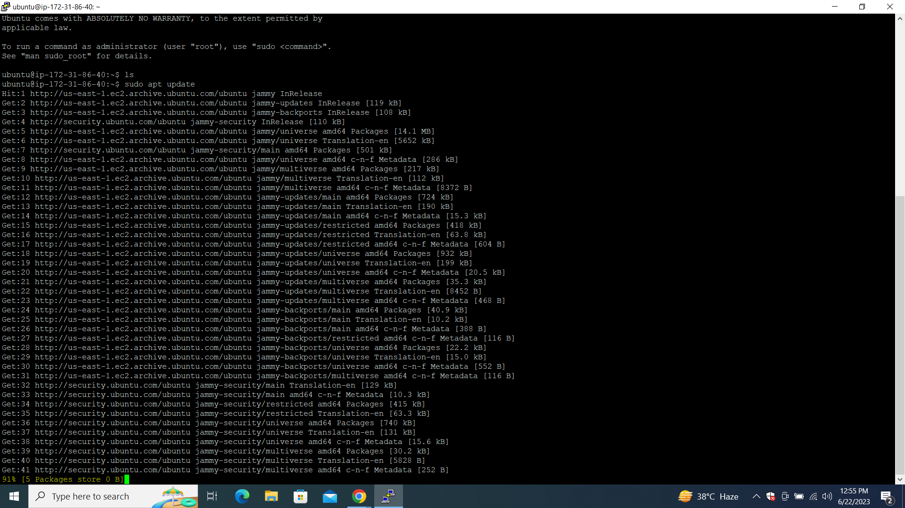

  
# CI/CD Pipeline for PHP Login Form Website
This repository contains the necessary files and instructions to set up a continuous integration and continuous deployment (CI/CD) pipeline for a PHP Login Form website using Docker, Git, GitHub, and Jenkins.

# Project Overview
The project demonstrates the deployment of a PHP Login Form app to AWS EC2 instances, consisting of a master node (Build-In Node) and a deployment server (deployment Node). 
The following DevOps services are utilized:
# Docker: Used to containerize the PHP Apache server and MySQL database.
# Git:** Used for version control and collaboration.
# GitHub:** The remote repository where the code is stored.
# Jenkins:** Used for automation, including triggering builds and deployments.
# Project setup
To set up the project on an Ubuntu EC2 instance, follow these steps:
Create an Ubuntu EC2 instance and name it "Build-In Node." Install Java and Jenkins on the instance and connect it with GitHub.
Push the PHP website code and the docker-compose.yml file to the instance.

# Update system packages
sudo apt update  
sudo apt upgrade  

# Install Java and Jenkins
sudo apt install openjdk-11-jdk -y
java --version
curl -fsSL https://pkg.jenkins.io/debian-stable/jenkins.io-2023.key | sudo tee /usr/share/keyrings/jenkins-keyring.asc > /dev/null
echo deb [signed-by=/usr/share/keyrings/jenkins-keyring.asc] https://pkg.jenkins.io/debian-stable binary/ | sudo tee /etc/apt/sources.list.d/jenkins.list > /dev/null
sudo apt-get update
sudo apt-get install jenkins
jenkins --version

# Create directories for PHP app and MySQL
mkdir php-app mysql

# Upload website files and database file using FileZilla or SFTP
# Upload *.php, *.html, *.css, etc. to php-app directory
# Upload *.sql to mysql directory
Create another Ubuntu EC2 instance and name it "deployment Node." Install Java, Docker, and Docker Compose on this instance.

sudo apt install openjdk-11-jdk -y  
sudo apt install docker.io  
sudo curl -L "https://github.com/docker/compose/releases/download/1.29.2/docker-compose-$(uname -s)-$(uname -m)" -o /usr/local/bin/docker-compose  
sudo chmod +x /usr/local/bin/docker-compose  
docker-compose --version  
Access the Jenkins home page, install recommended plugins, and manage Jenkins nodes and clouds.  

Open your web browser and navigate to the Jenkins home page.  
Install the recommended plugins.  
Click on "Manage Jenkins" and select "Nodes and Clouds."  
Create a new node named "deployment" with the appropriate settings.  
Connect to the deployment instance via SSH and execute the provided Linux command for connection.  
Create a Jenkins job named "Git-job" to connect with Git and configure it to run automatically in the deployment environment.  

Open the Jenkins web interface and log in.  
Create a new Jenkins job named "Git-job" as a freestyle project.  
Configure the Git repository URL.  
Enable the "GitHub hook trigger for GITScm polling" build trigger.  
Enable the "Build after other projects are built" option and add "build-website" as the project to build.  
Restrict the job to run only on the "deployment" environment.  
Configure additional build steps as needed.  
Savethe job configuration.  
Create a Jenkins job named "build-website" and restrict it to run on the "deployment" node.  

Open the Jenkins home page.  
Click on "New Item" to create a new job.  
Enter "build-website" as the name for the job and select the "Freestyle project" option.  
In the job configuration page, restrict the job to run on the "deployment" node.  
Add an "Execute shell" build step with the following commands:  

echo "y" | sudo docker rm -f $(sudo docker ps -a -q)  
sudo docker-compose -f /home/ubuntu/jenkins/workspace/Git-job/docker-compose.yml up -d  
Save the job configuration.  
Set up the CI/CD pipeline.  

Run the "Git-job" first, which will push the code from the GitHub repository to the deployment server.  
Once the "Git-job" completes successfully, the "build-website" job will automatically trigger.  
The "build-website" job will create two Docker container images: one for the Apache and PHP server and another for the MySQL server.  
This ensures that the latest code changes are pushed to the deployment server, and the Docker containers are built and deployed for continuous integration and   continuous deployment.  
# Repository Structure
This repository contains the following files:  
**docker-compose.yml:** Docker Compose configuration file for setting up the PHP Apache server and MySQL database.    
**README.md:** Documentation file providing an overview of the project and setup instructions.  

# Prerequisites
To use this repository and set up the CI/CD pipeline, you need the following:  
**Ubuntu EC2 instances:** One for the master node (Build-In Node) and another for the deployment server (deployment Node).  
**Docker:** Installed on both the master node and deployment server.  
**Git:** Installed on the master node.  
**Jenkins:** Installed on the master node and connected with GitHub.  

# Conclusion
With this project, you can easily set up a CI/CD pipeline for a PHP Login Form website using Docker, Git, GitHub, and Jenkins.  
The pipeline allows for continuous integration and continuous deployment, ensuring that code changes are automatically pushed to the deployment server and the    application is deployed in Docker containers.  
For more details and step-by-step instructions, please refer to the project's documentation and follow the outlined steps.  

If you have any questions or need further assistance, feel free to reach out to the project's author, Muhammad Uzair.  
# Email
uzair.jamil11@gmail.com  
+923155778545  
